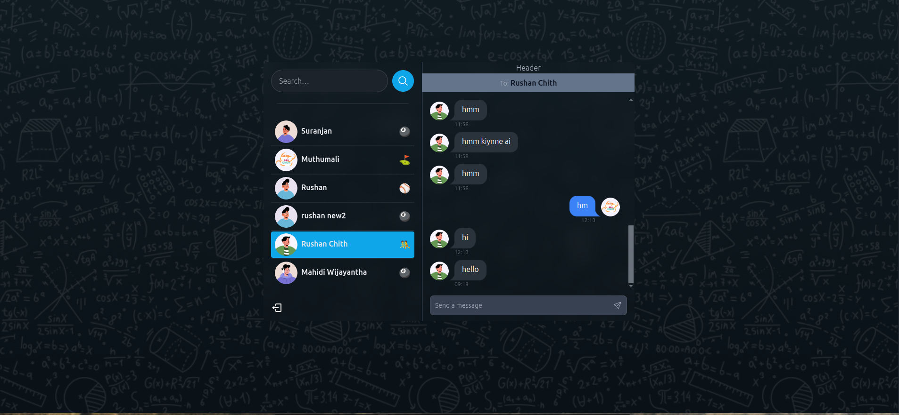

# Chat App

A real-time chat application built with React.js for the front-end and Node.js with Express.js for the back-end, utilizing WebSocket for seamless real-time communication.

## Web Url: https://talkie.rushanchithranga.me

## Features

- User sign-up and login functionality.
- Real-time chatting between users using WebSocket.
- Responsive design for seamless usage on different devices.
- Secure authentication and data handling.

## Screenshots


*Login Page*


*Chat Interface*

## Tech Stack

**Front-end**: React.js, Tailwind CSS  
**Back-end**: Node.js, Express.js  
**Database**: MongoDB (or your chosen database)  
**Real-Time Communication**: WebSocket, Socket.io

## Installation and Setup

Follow these steps to clone and set up the project locally.

### Prerequisites

Ensure you have the following installed:

- Node.js (v18 or later recommended)
- MongoDB (if using locally)
- Git

## Folder Structure

```
chat-app/
├── Frontend/           # React front-end code
├── Backend/           # Node.js and Express back-end code
├── README.md         # Project documentation
```

### Clone the Repository

```bash
git clone https://github.com/your-username/chat-app.git
cd chat-app
```

### Set Up the Back-end

1. Navigate to the `server` directory:

   ```bash
   cd server
   ```

2. Install dependencies:

   ```bash
   npm install
   ```

3. Create a `.env` file in the `server` directory and add your environment variables (update with your credentials):

   ```env
   PORT=8000
   MONGO_URI=mongodb+srv://<username>:<password>@cluster.mongodb.net/chatapp
   JWT_SECRET=your_secret_key
   NODE_ENV=development
   ```

4. Start the server:

   ```bash
   npm server
   ```

### Set Up the Front-end

1. Navigate to the `client` directory:

   ```bash
   cd ../client
   ```

2. Install dependencies:

   ```bash
   npm install
   ```

3. Create a `.env` file in the `client` directory and add your environment variables:

   ```env
   REACT_APP_API_URL=http://localhost:5000
   ```

4. Start the development server:

   ```bash
   npm start
   ```

### Running the Application

- Back-end server will run on `http://localhost:8000`
- Front-end application will run on `http://localhost:3000`


